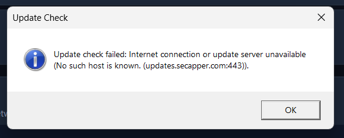

# SecApper — Folder Locker & Windows Security Engine

<p align="center">
  
</p>

<p align="center">
  <strong>SECURE YOUR WORLD</strong><br />
  <em>Commercial-Grade Offline-First Folder Security &amp; Ransomware Protection for Windows 10 / 11</em>
</p>

<p align="center">
  
  
  
  
  
</p>

---

## Overview

**SecApper** is a desktop cybersecurity application engineered for Windows 10 and Windows 11. It provides offline folder access protection using native Windows NTFS Access Control Lists (ACLs), cryptographic password verification, real-time ransomware heuristic monitoring, automatic state recovery, and secure in-place live updates.

Unlike simple hiding or obfuscation tools, SecApper enforces filesystem-level security descriptors: locked folders cannot be accessed, read, or modified by unauthorized local users, background processes, or malware without authentication.

---

## Key Features

### 1. Native Windows NTFS Access Control
- **True Filesystem Restriction**: Strips inheritance and injects Deny access control entries (ACEs) for `Read`, `Write`, `ListDirectory`, `Delete`, and `Execute`.
- **Non-Destructive Enforcement**: Locking never moves, compresses, or deletes your files. Unlocking accurately restores original Security Descriptor Definition Language (SDDL) permissions.
- **Custom Desktop Indicators**: Updates folder icon descriptors to indicate locked status via Windows Shell.

### 2. Active Explorer Double-Click Interception
- **Seamless User Experience**: When a user double-clicks a locked folder in Windows Explorer, SecApper intercepts the access denial and automatically displays the centered **Unlock Folder** dialog.
- **Auto-Open on Authentication**: Entering the correct password unlocks the directory and opens it in Windows Explorer immediately.

### 3. Real-Time Ransomware Protection
- **FileSystemWatcher Heuristics**: Monitors protected folders in real time for suspicious mass file modifications, rapid renaming, and extension tampering.
- **Threat Scoring & Alerting**: Computes multi-factor threat scores and logs security events with process attribution (`ProcessId`, `ProcessPath`).
- **Emergency Panic Lock**: Instantly secures all registered folders upon heuristic threat detection or via system tray shortcut.

### 4. Recovery Center & Integrity Verification
- **SDDL Permission Backups**: Stores cryptographic hashes and original ACL descriptors in an offline SQLite database.
- **Consistency Scanner**: Detects interrupted operations (e.g., unexpected system shutdowns) and provides one-click `Repair Protection` and `Restore Access` routines.

### 5. Live Online Software Updates
- **In-Place Upgrades**: Checks remote manifest endpoints for verified updates without third-party dependencies.
- **Cryptographic Verification**: Validates downloaded update payloads against SHA-256 signatures before execution.
- **Data Protection Guarantee**: Preserves local databases, encrypted credentials, folder registrations, and security logs through all updates.
- **Offline Resilience**: If no internet connection is present, SecApper continues running without interruption.

### 6. Modern Cybersecurity Desktop Interface
- **Brand Identity**: Built using SecApper's Deep Navy (`#122D55`) and Security Red (`#C5202B`) brand system.
- **Unified Navigation**: Fixed 260px left sidebar featuring Dashboard, Folder Locker, Protected Folders, Ransomware Protection, Security Events, Recovery, Updates, and Settings.
- **Audit Logging**: Searchable and filterable security event logs with CSV export.

---

## Solution Architecture

```
SecApperFolderLocker.sln
│
├── src/
│   ├── SecApper.Security/             # Core security engine library
│   │   ├── Data/                      # SQLite persistence (DatabaseService)
│   │   ├── Models/                    # FolderRecord, SecurityEvent, ProtectionPolicy
│   │   ├── Ransomware/                # Heuristics, ThreatScoring, FileSystemWatcher
│   │   ├── Recovery/                  # RecoveryService & SDDL backup verification
│   │   ├── Security/                  # AclService, FolderLockService, PasswordService
│   │   ├── Services/                  # PathValidator, ProcessMonitor, IconService
│   │   └── Updates/                   # UpdateService, ManifestParser, Verification
│   │
│   ├── SecApper.Updater/              # Standalone updater helper process
│   │   └── Program.cs                 # Process termination, payload extraction & restart
│   │
│   └── SecApper.FolderLocker/         # WPF Desktop GUI application
│       ├── Resources/                 # Official logo.png, app.ico, vector geometries
│       ├── Services/                  # AccessMonitor, ExplorerIntegration, TrayService
│       ├── ViewModels/                # MainViewModel, FolderItemViewModel, DialogViewModels
│       └── Views/                     # MainWindow, UnlockDialog, LockFolderDialog, etc.
│
├── tests/
│   └── SecApper.FolderLocker.Tests/   # Unit & integration tests (31 test suites)
│
└── installer/
    ├── SecApperFolderLocker.iss       # Inno Setup 6 packaging configuration
    └── output/                        # Compiled setup executables
```

---

## Getting Started

### Prerequisites
- **Operating System**: Windows 10 or Windows 11 (64-bit)
- **Filesystem**: NTFS (required for Windows Access Control Lists)
- **Development SDK**: [.NET 8.0 SDK](https://dotnet.microsoft.com/download/dotnet/8.0) (Windows Desktop workload)
- **Installer Tool** *(Optional)*: [Inno Setup 6](https://jrsoftware.org/isdl.php)

---

### Build from Source

1. **Clone the repository**:
   ```bash
   git clone <repository-url>
   cd Secapper
   ```

2. **Restore dependencies**:
   ```bash
   dotnet restore SecApperFolderLocker.sln
   ```

3. **Build the solution**:
   ```bash
   dotnet build SecApperFolderLocker.sln -c Release
   ```

4. **Run test suite**:
   ```bash
   dotnet test SecApperFolderLocker.sln
   ```
   *All 31 unit and integration tests should pass.*

---

### Publish Self-Contained Release

To generate the standalone executable bundle (no separate .NET runtime installation required on client machines):

```bash
dotnet publish src/SecApper.FolderLocker/SecApper.FolderLocker.csproj -c Release -r win-x64 --self-contained -o publish
```

The compiled application files will be written to `publish/SecApper.FolderLocker.exe`.

---

### Compile Windows Installer

To build the Inno Setup installer:

```powershell
& "C:\Users\<User>\AppData\Local\Programs\Inno Setup 6\ISCC.exe" installer\SecApperFolderLocker.iss
```

The resulting installer package will be output to:
```
installer/output/SecApperFolderLockerSetup_v1.1.0.exe
```

---

## Usage Guide

1. **Locking a Folder**:
   - Navigate to **Folder Locker** or click **+ Add Folder** on the Dashboard.
   - Select your target folder using the native browser.
   - Enter and confirm your secure password (minimum 6 characters).
   - SecApper applies native Windows NTFS permissions and begins background monitoring.

2. **Unlocking a Folder**:
   - Select the folder in **Protected Folders** and click **Unlock**, or double-click the locked folder directly in **Windows Explorer**.
   - Enter your password in the prompt.
   - SecApper restores original permissions and opens the folder.

3. **Running in the Background**:
   - Closing the main window minimizes SecApper to the Windows System Tray to keep double-click interception and ransomware monitoring active.
   - Right-click the tray icon to **Open**, **Lock All**, activate **Panic Lock**, or **Exit**.

---

## Security & Privacy Commitment

- **Local Storage Only**: All password hashes (PBKDF2/Argon2 with high-iteration salt), original SDDL permission backups, and security events are stored locally in `%LOCALAPPDATA%\SecApper\FolderLocker\locker.db`.
- **No Cloud Telemetry**: SecApper does not track, collect, or transmit folder names, paths, metadata, or telemetry to external servers.
- **Offline Integrity**: Core security features operate 100% offline. Network communication is only utilized when explicitly checking for software updates.

---

## License

Copyright © 2026 SecApper. All rights reserved.  
Protected under proprietary commercial cybersecurity software licensing.
